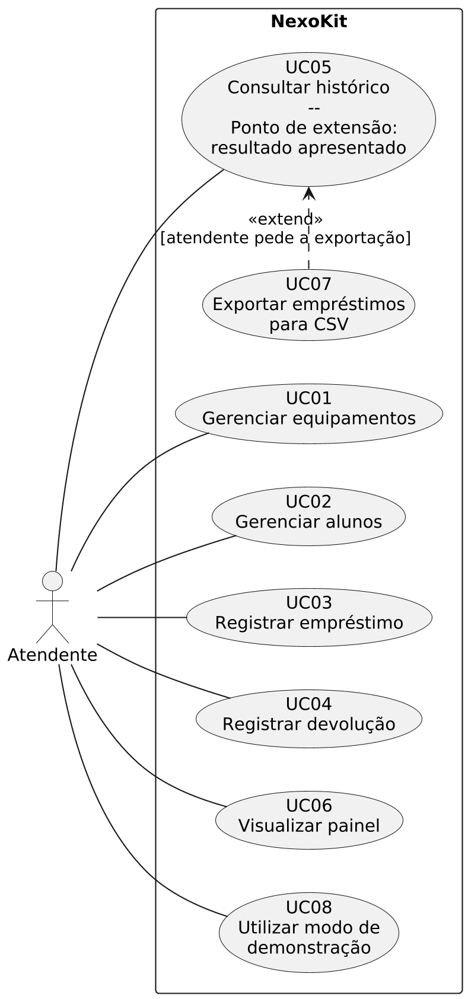
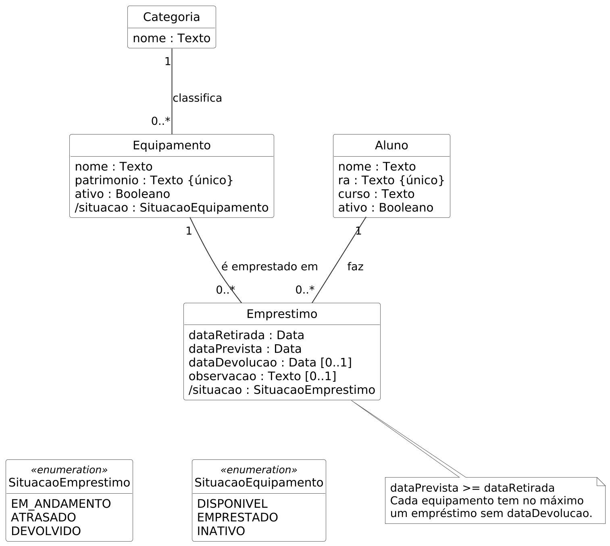

# NexoKit

Sistema desktop para controlar o empréstimo de equipamentos acadêmicos (projetores, microfones, adaptadores). O atendente cadastra alunos e equipamentos, registra retiradas e devoluções, acompanha atrasos e consulta o histórico.

Projeto integrador da disciplina Desenvolvimento de Sistemas I (Sistemas de Informação, Mackenzie, 2026/2), feito pela Equipe Órbita: Kaio Kenzo Costa Nacamura e Vinicius Bizarria da Silva.

## Situação

O projeto está na fase de modelagem. A cada entrega da disciplina este repositório ganha um diagrama novo, e o código vem depois.

| Etapa | Conteúdo | Situação |
| --- | --- | --- |
| 1 | Termo de abertura, escopo e requisitos | feita, ver [`docs/requisitos.md`](docs/requisitos.md) |
| 2 | Casos de uso e especificações | feita |
| 3 | Classes de domínio e dicionário de domínio | feita, ver [`docs/dicionario-de-dominio.md`](docs/dicionario-de-dominio.md) |
| 4 | Classes de implementação e diagrama de sequência | próxima |
| 5 | Diagramas de estado | |
| 6 | Diagramas de atividades | |
| | Código em Python, Tkinter e SQLite | depois da modelagem |

## Casos de uso

O Atendente é o único ator: o aluno vai ao balcão, mas quem usa o sistema é o atendente. A exportação para CSV (UC07) estende a consulta do histórico (UC05), porque só acontece quando o atendente está vendo o resultado de uma busca.



## Classes de domínio

O empréstimo liga um aluno a um equipamento. Cada equipamento só pode ter um empréstimo aberto por vez, regra que está na nota do diagrama.



## Tecnologias previstas

- Python 3.10 ou mais novo, com Tkinter para a interface
- SQLite para guardar os dados no próprio computador
- PlantUML para os diagramas (os arquivos `.puml` estão em `docs/diagramas/`)

## Gerando os diagramas

Com o PlantUML instalado:

```bash
plantuml docs/diagramas/*.puml
```

No VS Code, a extensão PlantUML mostra a prévia com `Alt + D`.
